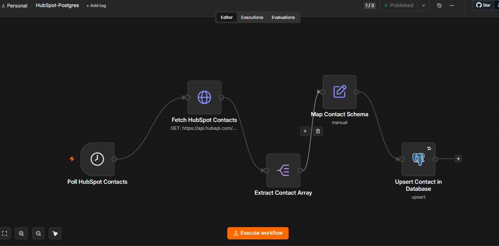

# 🚀 Proyecto 2: Sincronización CRM a Base de Datos (HubSpot ↔ PostgreSQL)

## 📖 Descripción del Problema
El equipo de operaciones necesitaba acceder a los datos de contactos del CRM (HubSpot) desde una base de datos relacional interna (PostgreSQL) para cruzar datos financieros y generar reportes. Las exportaciones manuales generaban cuellos de botella y discrepancias en los datos.

## 🎯 Objetivo (Portfolio)
Construir un pipeline de extracción estructurada que consulte periódicamente HubSpot, extraiga los leads/contactos y los sincronice en PostgreSQL. El sistema debe garantizar que no se creen registros duplicados bajo ninguna circunstancia y enrutar las alertas de fallo al departamento correspondiente.

## 🏗 Arquitectura y Tecnologías
* **Orquestador:** n8n
* **Trigger:** Schedule Trigger (Cron / Polling temporal)
* **Origen de Datos:** API de HubSpot
* **Destino de Datos:** Base de datos PostgreSQL
* **Observabilidad:** Slack (Sistema de enrutamiento dinámico de errores)

## ⚙️ Decisiones Técnicas Destacadas
1. **Arquitectura Pull vs. Push:** En lugar de saturar el sistema con webhooks individuales por cada cambio en HubSpot, se implementó un mecanismo de extracción periódica (*Polling* con Schedule Trigger). Esto permite controlar el volumen de consumo de la API y mitigar riesgos de límite de peticiones (*Rate Limits*).
2. **Idempotencia Transaccional (Upsert):** El nodo de PostgreSQL no hace inserciones a ciegas. Está configurado para realizar una operación *Upsert* (Insertar o Actualizar) utilizando un identificador único (ID de HubSpot o Email) como clave. Si el flujo procesa el mismo registro dos veces, simplemente lo actualiza, garantizando la integridad de la base de datos sin generar duplicados.
3. **Enrutamiento Dinámico de Alertas:** Los errores no van a un canal genérico. El workflow está protegido por un controlador global (`Error Trigger`). Si la sincronización falla (ej. endpoint roto o base de datos inactiva), el sistema evalúa el nombre del workflow a través de un nodo `Switch` y enruta la alerta técnica exclusivamente al canal de Slack `#crm-hubspot`, reduciendo el ruido para el resto del equipo.

## 🛡️ Seguridad
* Las credenciales de acceso a la base de datos y los tokens de HubSpot están aislados en el gestor de credenciales nativo de n8n.

## 🚧 Limitaciones y Posibles Mejoras (Next Steps)
* **Limitación Actual:** Si se produce una importación masiva en HubSpot, recuperar miles de contactos en una sola petición podría agotar la memoria del nodo o chocar contra el límite de la API.
* **Mejora Propuesta:** Implementar lógica de **paginación explícita** mediante un nodo `Loop` para extraer los registros en bloques (ej. 100 por iteración) hasta agotar la lista.

## 📸 Capturas de Pantalla
*(Añade tus capturas aquí)*
