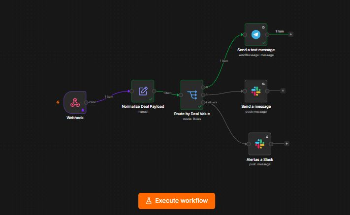

# 🚀 Proyecto 3: Enrutamiento Inteligente de Leads y Alertas Multicanal

## 📖 Descripción del Problema
El equipo de ventas necesitaba notificaciones en tiempo real sobre nuevas oportunidades de negocio, priorizando los tratos de alto valor. Sin embargo, el sistema anterior fallaba silenciosamente o enrutaba mal los leads cuando el CRM enviaba datos incompletos (por ejemplo, oportunidades sin valor económico definido), provocando que los comerciales perdieran tiempo o ignoraran clientes VIP.

## 🎯 Objetivo (Portfolio)
Construir un pipeline de ventas tolerante a fallos que reciba payloads de un CRM externo, normalice los tipos de datos y enrute las alertas de forma determinista hacia Slack (tratos estándar) o Telegram (tratos VIP). El sistema debe contar con una vía de escape (fallback) para capturar y auditar cualquier dato corrupto sin detener la ejecución.

## 🏗 Arquitectura y Tecnologías
* **Orquestador:** n8n
* **Trigger:** Webhook (Recepción de payload en tiempo real)
* **Lógica de Negocio:** Switch Node (Enrutamiento condicional)
* **Canales de Salida:** API de Slack y API de Telegram

## ⚙️ Decisiones Técnicas Destacadas
1. **Normalización de Datos (Defensive Programming):** Antes de evaluar cualquier regla de negocio, el payload entrante pasa por un proceso de tipado estricto. Esto previene errores comunes de coerción de tipos en JavaScript (ej. donde `null` se evalúa como `0`), garantizando que las condiciones matemáticas posteriores sean precisas.
2. **Enrutamiento por Reglas de Negocio:** Se implementó una bifurcación clara utilizando un nodo `Switch`. Las oportunidades con valor igual o superior a 5.000€ se envían por Telegram para atención inmediata, mientras que el resto va al canal general de Slack.
3. **Vía de Escape (Fallback):** En lugar de permitir que el workflow falle ante un dato inesperado (ej. campo `amount` vacío), se habilitó la salida *Fallback* del nodo Switch. Cualquier registro que no cumpla las reglas numéricas es expulsado por esta tercera vía y enviado a un canal de Operaciones para su revisión manual.

## 🛡️ Manejo de Errores
El sistema no asume que la API de origen enviará datos perfectos. La combinación de normalización previa y la ruta de *Fallback* actúa como un escudo protector, asegurando que ningún lead se pierda por un error informático y aislando los registros problemáticos del flujo de ventas principal.

## 🚧 Limitaciones y Posibles Mejoras (Next Steps)
* **Limitación Actual:** El umbral de 5.000€ está "hardcodeado" (fijado manualmente) dentro del nodo Switch. Si el negocio decide cambiarlo, requiere un despliegue técnico.
* **Mejora Propuesta:** Extraer las reglas de negocio a una tabla de configuración externa (ej. PostgreSQL o Airtable) y cachear esos valores en n8n al inicio de la ejecución, permitiendo a Operaciones cambiar los umbrales sin tocar el código.

## 📸 Capturas de Pantalla
*(Añade tus capturas de la arquitectura, la configuración del Switch y el manejo del Fallback aquí)*
